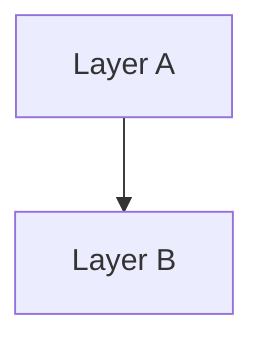

# B-02 分层深度解析（亮点 / 难点 / 技术细节）

## 1. 分层总图（Mermaid）



## 2. Layer-X

### 职责
### 亮点
### 难点
### 基于亮点的技术细节

#### 实现卡片：<实现名称>
- What: <一句话说明行为>
- Where: `path/to/file.ts:123`
- Why it matters: <对架构/稳定性的影响>

```ts
// 摘录 5-20 行关键实现
```

## 3. Layer-Y

### 职责
### 亮点
### 难点
### 基于亮点的技术细节

#### 实现卡片：<实现名称>
- What: <一句话说明行为>
- Where: `path/to/file.ts:456`
- Why it matters: <对架构/稳定性的影响>

```ts
// 摘录 5-20 行关键实现
```
